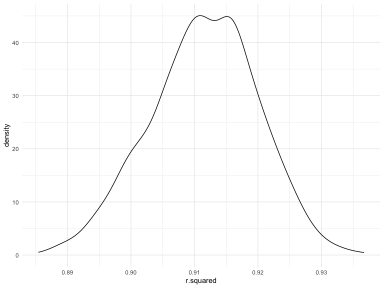
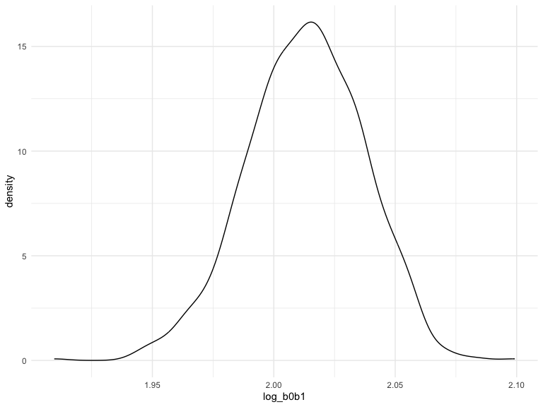

p8105_hw6_maf2311
================
Mackenzie Frost (maf2311)

December 3, 2022

# Problem 1

2017 Central Park weather data

``` r
weather_df = 
  rnoaa::meteo_pull_monitors(
    c("USW00094728"),
    var = c("PRCP", "TMIN", "TMAX"), 
    date_min = "2017-01-01",
    date_max = "2017-12-31") %>%
  mutate(
    name = recode(id, USW00094728 = "CentralPark_NY"),
    tmin = tmin / 10,
    tmax = tmax / 10) %>%
  select(name, id, everything())
```

    ## Registered S3 method overwritten by 'hoardr':
    ##   method           from
    ##   print.cache_info httr

    ## using cached file: ~/Library/Caches/R/noaa_ghcnd/USW00094728.dly

    ## date created (size, mb): 2022-10-04 10:05:39 (8.408)

    ## file min/max dates: 1869-01-01 / 2022-10-31

The boostrap is helpful when you’d like to perform inference for a
parameter / value / summary that doesn’t have an easy-to-write-down
distribution in the usual repeated sampling framework. We’ll focus on a
simple linear regression with tmax as the response and tmin as the
predictor, and are interested in the distribution of two quantities
estimated from these data:

- r̂ 2
- log(β̂ 0∗β̂ 1)

Use 5000 bootstrap samples and, for each bootstrap sample, produce
estimates of these two quantities. Plot the distribution of your
estimates, and describe these in words. Using the 5000 bootstrap
estimates, identify the 2.5% and 97.5% quantiles to provide a 95%
confidence interval for r̂ 2 and log(β̂ 0∗β̂ 1). Note: broom::glance() is
helpful for extracting r̂ 2 from a fitted regression, and broom::tidy()
(with some additional wrangling) should help in computing log(β̂ 0∗β̂ 1)

``` r
weather_df %>% 
  modelr::bootstrap(n = 1000) %>% 
  mutate(
    models = map(strap, ~lm(tmax ~ tmin, data = .x) ),
    results = map(models, broom::glance)) %>% 
  select(-strap, -models) %>% 
  unnest(results) %>% 
  ggplot(aes(x = r.squared)) + geom_density()
```



``` r
weather_df %>% 
  modelr::bootstrap(n = 1000) %>% 
  mutate(
    models = map(strap, ~lm(tmax ~ tmin, data = .x) ),
    results = map(models, broom::tidy)) %>% 
  select(-strap, -models) %>% 
  unnest(results) %>% 
  select(id = `.id`, term, estimate) %>% 
  pivot_wider(
    names_from = term, 
    values_from = estimate) %>% 
  rename(beta0 = `(Intercept)`, beta1 = tmin) %>% 
  mutate(log_b0b1 = log(beta0 * beta1)) %>% 
  ggplot(aes(x = log_b0b1)) + geom_density()
```



# Problem 2

Homicides in 50 large US cities, Washington Post

``` r
homicides = read_csv(file = "./data/data-homicides-master/homicide-data.csv", 
    col_types = "cncccncccnnc") %>%
  mutate(
    city_state = str_c(city, ", ", state),
    solved = ifelse((disposition == "Closed without arrest" | disposition == "Open/No arrest"), 0, 1)
  ) %>%
  filter(city_state != "Dallas, TX", city_state != "Phoenix, AZ",city_state != "Kansas City, MO", city_state != "Tulsa, AL") %>%
  filter(victim_race %in% c("White", "Black"))

#test to see if victim_age is numeric = TRUE
is.numeric(homicides$victim_age)
```

    ## [1] TRUE

For the city of Baltimore, MD, use the glm function to fit a logistic
regression with resolved vs unresolved as the outcome and victim age,
sex and race as predictors:

``` r
homicides_logistic = homicides %>% 
  filter(city_state == "Baltimore, MD") %>% 
  glm(solved ~ victim_age + victim_race + victim_sex, data = ., family = binomial()) 

ci = as.data.frame(confint(homicides_logistic))
```

    ## Waiting for profiling to be done...

``` r
homicides_logistic %>% 
  broom::tidy() %>% 
  mutate(OR = exp(estimate),
         lower = exp(ci$`2.5 %`),
         upper = exp(ci$`97.5 %`)) %>%
  select(term, log_OR = estimate, OR, lower, upper, p.value) %>% 
  knitr::kable(digits = 3)
```

| term             | log_OR |    OR | lower | upper | p.value |
|:-----------------|-------:|------:|------:|------:|--------:|
| (Intercept)      |  0.310 | 1.363 | 0.976 | 1.911 |   0.070 |
| victim_age       | -0.007 | 0.993 | 0.987 | 1.000 |   0.043 |
| victim_raceWhite |  0.842 | 2.320 | 1.650 | 3.276 |   0.000 |
| victim_sexMale   | -0.854 | 0.426 | 0.324 | 0.558 |   0.000 |

The adjusted odds ratio for solving homicides for male victims is 0.426
(95% CI: 0.324,0.558) compared to female victims, keeping all other
variables fixed.

Now run glm for each of the cities in your dataset, and extract the
adjusted odds ratio (and CI) for solving homicides comparing male
victims to female victims.

``` r
nest_glm_cities =
  homicides %>% 
  nest(data = -city_state) %>% 
  mutate(
    models = map(data, ~glm(solved ~ victim_age + victim_race + victim_sex, data = ., family = binomial())),
    results = map(models, broom::tidy)) %>% 
  select(-data, -models) %>% 
  unnest(results)

nest_glm_cities = nest_glm_cities %>%
  mutate(
    OR = format(round(exp(estimate), 3), nsmall = 3),
    lower = format(round(exp(estimate - (1.96*std.error)), 3), nsmall = 3),
    upper = format(round(exp(estimate + (1.96*std.error)), 3), nsmall = 3)
  ) %>%
  filter(term == "victim_sexMale")
```

Plot that shows the estimated ORs and CIs for each city, organized
according to estimated OR

``` r
ggplot(nest_glm_cities, aes(x = city_state, y = OR)) + 
  geom_point() +
  geom_errorbar(aes(ymin = lower, ymax = upper), width = 0.2) +
  labs(
    title = "Adjusted ORs and CIs for solving homicides comparing male victims to female victims",
    x = "City",
    y = "Adjusted OR",
    caption = "Data from the Washington Post"
  ) +
  theme(axis.text.x = element_text(angle=90, hjust=1))
```


# Problem 3

Data on \~4000 children and their birthweight:

``` r
birthweight = read_csv(file = "./data/birthweight.csv") 
```

    ## Rows: 4342 Columns: 20
    ## ── Column specification ────────────────────────────────────────────────────────
    ## Delimiter: ","
    ## dbl (20): babysex, bhead, blength, bwt, delwt, fincome, frace, gaweeks, malf...
    ## 
    ## ℹ Use `spec()` to retrieve the full column specification for this data.
    ## ℹ Specify the column types or set `show_col_types = FALSE` to quiet this message.

``` r
birthweight %>% skimr::skim()
```

|                                                  |            |
|:-------------------------------------------------|:-----------|
| Name                                             | Piped data |
| Number of rows                                   | 4342       |
| Number of columns                                | 20         |
| \_\_\_\_\_\_\_\_\_\_\_\_\_\_\_\_\_\_\_\_\_\_\_   |            |
| Column type frequency:                           |            |
| numeric                                          | 20         |
| \_\_\_\_\_\_\_\_\_\_\_\_\_\_\_\_\_\_\_\_\_\_\_\_ |            |
| Group variables                                  | None       |

Data summary

**Variable type: numeric**

| skim_variable | n_missing | complete_rate |    mean |     sd |     p0 |     p25 |     p50 |     p75 |   p100 | hist  |
|:--------------|----------:|--------------:|--------:|-------:|-------:|--------:|--------:|--------:|-------:|:------|
| babysex       |         0 |             1 |    1.49 |   0.50 |   1.00 |    1.00 |    1.00 |    2.00 |    2.0 | ▇▁▁▁▇ |
| bhead         |         0 |             1 |   33.65 |   1.62 |  21.00 |   33.00 |   34.00 |   35.00 |   41.0 | ▁▁▆▇▁ |
| blength       |         0 |             1 |   49.75 |   2.72 |  20.00 |   48.00 |   50.00 |   51.00 |   63.0 | ▁▁▁▇▁ |
| bwt           |         0 |             1 | 3114.40 | 512.15 | 595.00 | 2807.00 | 3132.50 | 3459.00 | 4791.0 | ▁▁▇▇▁ |
| delwt         |         0 |             1 |  145.57 |  22.21 |  86.00 |  131.00 |  143.00 |  157.00 |  334.0 | ▅▇▁▁▁ |
| fincome       |         0 |             1 |   44.11 |  25.98 |   0.00 |   25.00 |   35.00 |   65.00 |   96.0 | ▃▇▅▂▃ |
| frace         |         0 |             1 |    1.66 |   0.85 |   1.00 |    1.00 |    2.00 |    2.00 |    8.0 | ▇▁▁▁▁ |
| gaweeks       |         0 |             1 |   39.43 |   3.15 |  17.70 |   38.30 |   39.90 |   41.10 |   51.3 | ▁▁▂▇▁ |
| malform       |         0 |             1 |    0.00 |   0.06 |   0.00 |    0.00 |    0.00 |    0.00 |    1.0 | ▇▁▁▁▁ |
| menarche      |         0 |             1 |   12.51 |   1.48 |   0.00 |   12.00 |   12.00 |   13.00 |   19.0 | ▁▁▂▇▁ |
| mheight       |         0 |             1 |   63.49 |   2.66 |  48.00 |   62.00 |   63.00 |   65.00 |   77.0 | ▁▁▇▂▁ |
| momage        |         0 |             1 |   20.30 |   3.88 |  12.00 |   18.00 |   20.00 |   22.00 |   44.0 | ▅▇▂▁▁ |
| mrace         |         0 |             1 |    1.63 |   0.77 |   1.00 |    1.00 |    2.00 |    2.00 |    4.0 | ▇▇▁▁▁ |
| parity        |         0 |             1 |    0.00 |   0.10 |   0.00 |    0.00 |    0.00 |    0.00 |    6.0 | ▇▁▁▁▁ |
| pnumlbw       |         0 |             1 |    0.00 |   0.00 |   0.00 |    0.00 |    0.00 |    0.00 |    0.0 | ▁▁▇▁▁ |
| pnumsga       |         0 |             1 |    0.00 |   0.00 |   0.00 |    0.00 |    0.00 |    0.00 |    0.0 | ▁▁▇▁▁ |
| ppbmi         |         0 |             1 |   21.57 |   3.18 |  13.07 |   19.53 |   21.03 |   22.91 |   46.1 | ▃▇▁▁▁ |
| ppwt          |         0 |             1 |  123.49 |  20.16 |  70.00 |  110.00 |  120.00 |  134.00 |  287.0 | ▅▇▁▁▁ |
| smoken        |         0 |             1 |    4.15 |   7.41 |   0.00 |    0.00 |    0.00 |    5.00 |   60.0 | ▇▁▁▁▁ |
| wtgain        |         0 |             1 |   22.08 |  10.94 | -46.00 |   15.00 |   22.00 |   28.00 |   89.0 | ▁▁▇▁▁ |

``` r
#all variables improted as numeric
#Based on the table output, there is no missing data
```

Propose a regression model for birthweight. This model may be based on a
hypothesized structure for the factors that underly birthweight, on a
data-driven model-building process, or a combination of the two.
Describe your modeling process and show a plot of model residuals
against fitted values – use add_predictions and add_residuals in making
this plot.

Compare your model to two others:

One using length at birth and gestational age as predictors (main
effects only) One using head circumference, length, sex, and all
interactions (including the three-way interaction) between these Make
this comparison in terms of the cross-validated prediction error; use
crossv_mc and functions in purrr as appropriate.

Note that although we expect your model to be reasonable, model building
itself is not a main idea of the course and we don’t necessarily expect
your model to be “optimal”.
